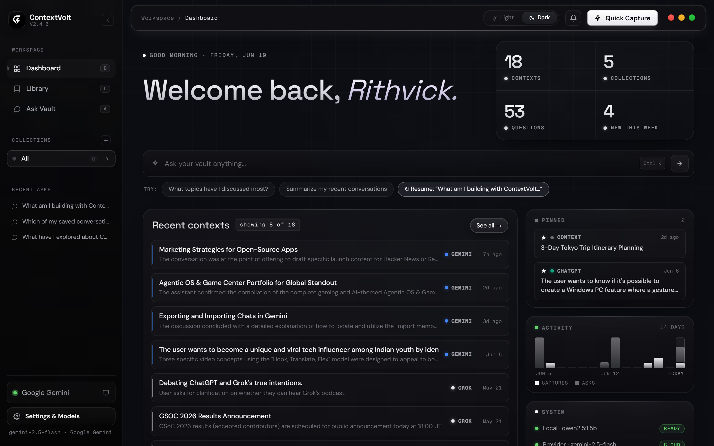
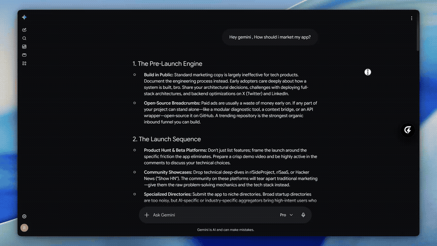
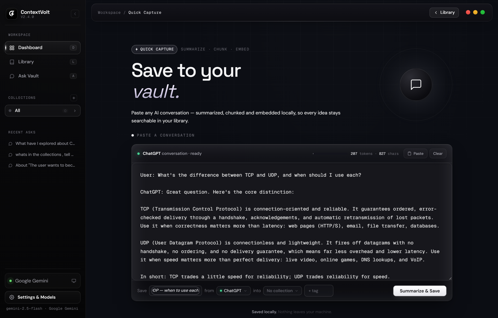
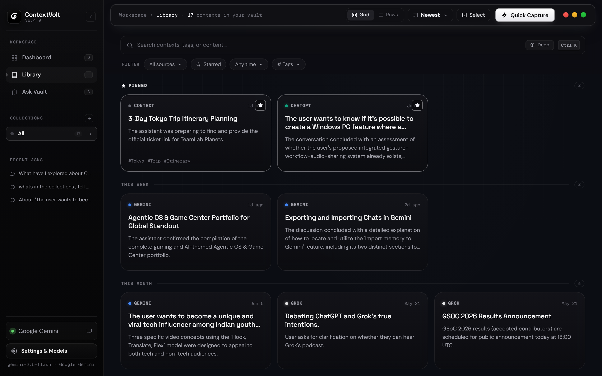
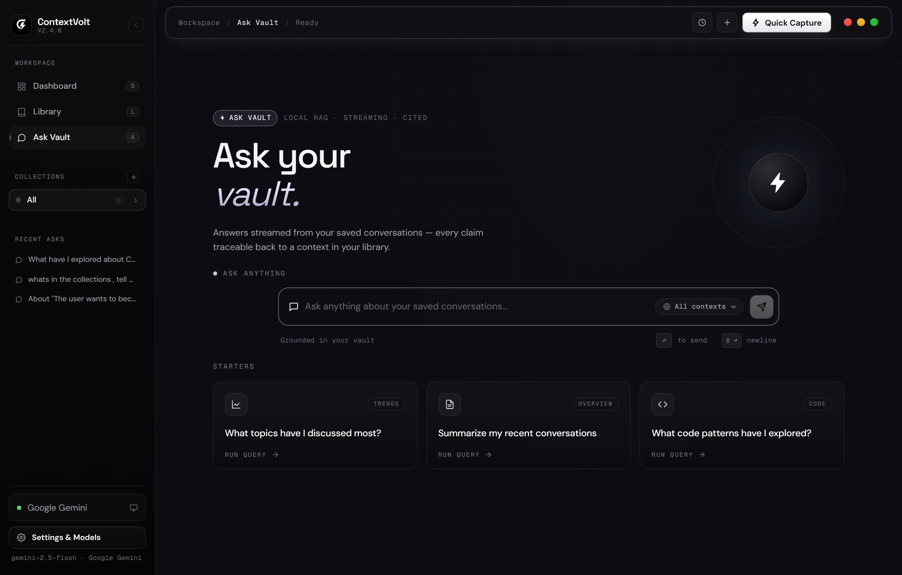
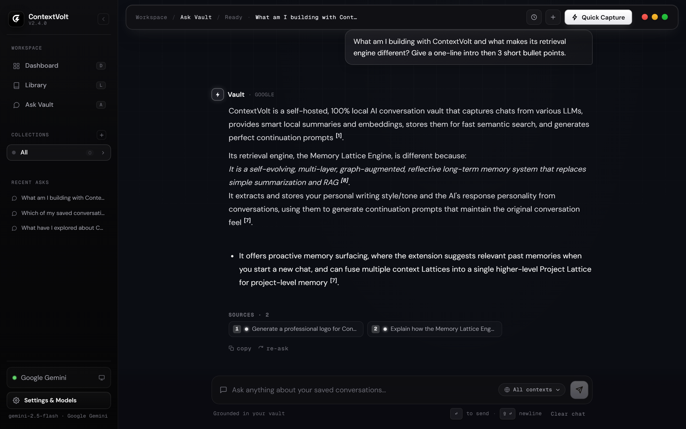
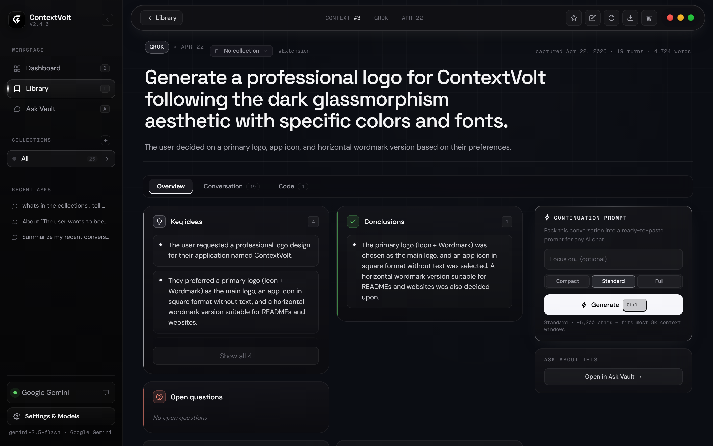
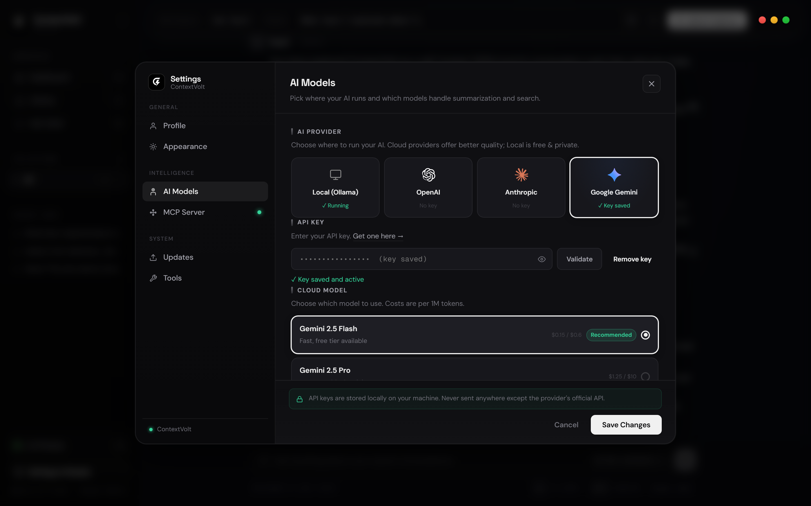
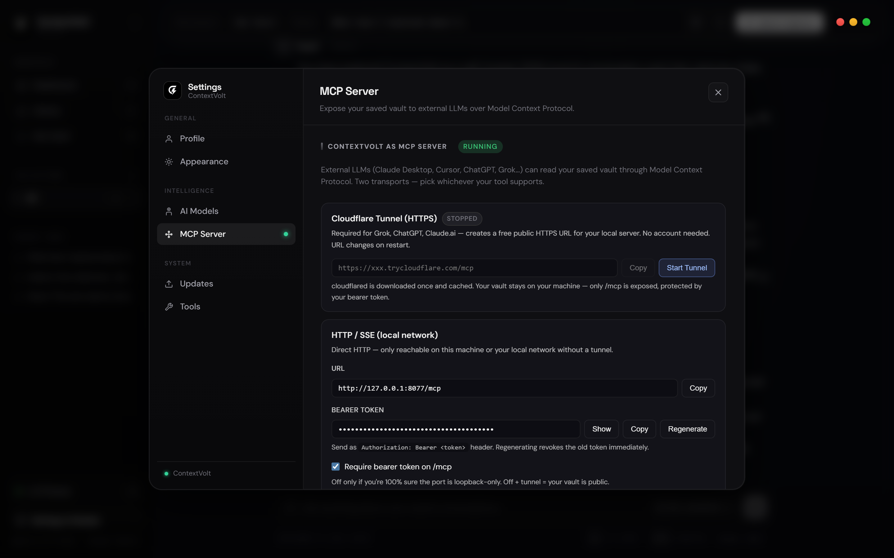

<p align="center">
  
</p>

<h1 align="center">ContextVolt</h1>

<p align="center">
  <strong>Save, summarize, search, and continue AI conversations across any LLM.</strong><br/>
  Self-hosted · 100% local · No cloud required · Your data stays on your device.
</p>

<p align="center">
  <a href="https://github.com/Rithvickkr/ContextVolt/releases"></a>
  
  
  
</p>

<p align="center">
  <a href="#features">Features</a> ·
  <a href="#install">Install</a> ·
  <a href="#quick-start">Quick Start</a> ·
  <a href="#browser-extension">Browser Extension</a> ·
  <a href="#ask-your-vault-rag">Ask Your Vault</a> ·
  <a href="#mcp-server">MCP Server</a> ·
  <a href="#api-reference">API</a> ·
  <a href="#troubleshooting--faq">Troubleshooting</a> ·
  <a href="#tech-stack">Tech Stack</a>
</p>

<p align="center">
  
</p>

---

## Demo

<p align="center">
  
</p>

<p align="center">
  <em>Capture any chat with one click → summarized &amp; indexed locally → generate a continuation prompt → resume the conversation in any AI tool.</em>
</p>

---

## What is ContextVolt?

ContextVolt is a **local-first context manager for AI conversations**. Every chat you have with ChatGPT, Claude, Gemini, Grok, DeepSeek, or Perplexity is a piece of context you usually lose. ContextVolt captures those conversations with one click, summarizes them with a local (or optional cloud) LLM, indexes them for hybrid semantic + keyword search, and turns them into a personal knowledge vault you can:

- **Continue** — generate a structured continuation prompt from any saved conversation and paste it into any AI tool to pick up exactly where you left off.
- **Ask** — chat with your entire vault ("Ask Your Vault"), a RAG pipeline that answers questions across all your saved conversations with inline citations.
- **Share with your AI tools** — a built-in **MCP server** exposes your vault to Claude Desktop, Claude Code, Cursor, and any other MCP host, locally or remotely over a secure tunnel.

No accounts. No API keys required. Everything runs on your machine.

### How it works

```
 Browser extension                ContextVolt (desktop app)                 Any LLM
┌──────────────────┐   capture   ┌────────────────────────────┐
│ ChatGPT / Claude │ ──────────► │ Summarize (Ollama / cloud) │
│ Gemini / Grok    │             │ Chunk + embed (sqlite-vec) │  prompt /  ┌─────────────┐
│ DeepSeek / Pplx  │             │ Index (FTS5 + entities)    │ ─────────► │ Continue in │
└──────────────────┘             │ Ask Your Vault (RAG)       │  MCP       │ any AI tool │
                                 │ MCP server (stdio / HTTP)  │            └─────────────┘
                                 └────────────────────────────┘
```

1. **Capture** — the browser extension grabs the full conversation from the page and posts it to the local backend.
2. **Summarize** — an LLM produces a structured summary (topic, key points, decisions, open questions). Runs on Ollama by default; OpenAI / Anthropic / Google optional.
3. **Index** — the conversation is chunked, embedded locally, and indexed three ways: vectors (semantic), FTS5/BM25 (keyword), and an entity index for identifier-shaped tokens like ticket IDs, env vars, and file paths.
4. **Use** — search the library, generate continuation prompts, ask cross-vault questions with citations, or let external AI tools read the vault over MCP.

---

## Features

### Capture & organize
- **One-click capture** — browser extension grabs full conversations from ChatGPT, Claude, Gemini, Grok, DeepSeek, and Perplexity
- **Local summarization** — powered by [Ollama](https://ollama.com) (Qwen 2.5 / Qwen 3 out of the box; any Ollama model works), with streaming progress
- **Cloud LLM support** — optionally route summarization through OpenAI, Anthropic, or Google APIs
- **Collections** — organize contexts into named groups; **starred contexts** pin your most important ones
- **Export & backup** — download any context as Markdown, or export a full vault backup

### Find & reuse
- **Ask Your Vault** — RAG-powered chat over all your saved conversations, with inline numbered citations linking back to sources, an LLM reranker, and per-collection scoping (see [details](#ask-your-vault-rag))
- **Hybrid search** — vector embeddings + FTS5/BM25 keyword index + entity lookup, fused for retrieval
- **Continuation prompts** — generate a structured prompt grounded in a saved context to resume the conversation in any AI tool
- **Saved Ask sessions** — every vault Q&A session is kept and revisitable

### Integrate
- **MCP server** — expose your vault read-only to Claude Desktop, Claude Code, Cursor, or any MCP host — over stdio locally, or over HTTPS via a one-click Cloudflare tunnel with OAuth + bearer-token auth (see [details](#mcp-server))
- **Local REST API** — full FastAPI surface at `http://127.0.0.1:8000` (see [API Reference](#api-reference))

### Desktop experience
- **Frameless native window** — custom title bar, edge-resize, Aero Snap (via PyWebView)
- **Three vibes** — **Volt** (default), **Space** (deep cosmic), and **Noir** (minimal), with a reduced-motion guard
- **Guided onboarding** — first-run tour walks through the real pages live; replayable from Settings
- **In-app updater** — checks GitHub Releases and applies updates from inside the app
- **Model manager** — pull, switch, and delete Ollama chat/embed models from Settings, with GPU-aware recommendations

---

## Screenshots

<table>
  <tr>
    <td width="50%"></td>
    <td width="50%"></td>
  </tr>
  <tr>
    <td align="center"><em>Quick Capture — paste any chat; summarized &amp; embedded locally</em></td>
    <td align="center"><em>Library — your saved conversations</em></td>
  </tr>
  <tr>
    <td width="50%"></td>
    <td width="50%"></td>
  </tr>
  <tr>
    <td align="center"><em>Ask Your Vault — local RAG, streaming, cited</em></td>
    <td align="center"><em>…answers with inline <code>[n]</code> citations back to sources</em></td>
  </tr>
  <tr>
    <td width="50%"></td>
    <td width="50%"></td>
  </tr>
  <tr>
    <td align="center"><em>Context detail — summary &amp; continuation prompt</em></td>
    <td align="center"><em>Settings — models, providers &amp; cloud routing</em></td>
  </tr>
</table>

---

## Install

### Windows

**Option A — Installer (recommended)**

Download [`ContextVolt-Setup.exe`](https://github.com/Rithvickkr/ContextVolt/releases) from the Releases page, run it, and launch from the Desktop shortcut. Existing installs are offered updates in-app.

**Option B — From source**

```bat
git clone https://github.com/Rithvickkr/ContextVolt.git
cd ContextVolt
start.bat
```

### macOS

**Option A — Homebrew (recommended, Apple Silicon)**

```bash
brew install --cask rithvickkr/tap/contextvolt
```

One command installs Ollama, places **ContextVolt.app** in Applications, and clears the Gatekeeper quarantine so it opens on first click — no warning. Update with `brew upgrade --cask contextvolt`.

**Option B — `.dmg` (Apple Silicon)**

Download `ContextVolt-*-macOS.dmg` from the [Releases page](https://github.com/Rithvickkr/ContextVolt/releases), open it, drag **ContextVolt.app** to Applications. The build is ad-hoc signed (no Apple Developer ID yet), so the first launch is blocked once by Gatekeeper:

> **First launch:** open the app, then go to **System Settings → Privacy & Security**, scroll to the bottom, and click **"Open Anyway."** (On older macOS, right-click the app → **Open**.) You only do this once.

**Option C — From source (Apple Silicon + Intel)**

```bash
curl -fsSL https://raw.githubusercontent.com/Rithvickkr/ContextVolt/master/install.sh | bash
```

### Linux

```bash
curl -fsSL https://raw.githubusercontent.com/Rithvickkr/ContextVolt/master/install.sh | bash
```

This clones the project to `~/.contextvolt`, creates a Python virtual environment, installs dependencies, and adds a `contextvolt` shell command.

```bash
contextvolt        # launch
```

```bash
cd ~/.contextvolt && git pull    # update
```

**Manual install (no curl):**

```bash
git clone https://github.com/Rithvickkr/ContextVolt.git ~/.contextvolt
cd ~/.contextvolt && bash start.sh
```

#### macOS notes

- **Homebrew is the smoothest path** (Option A) — the cask clears Gatekeeper quarantine automatically, so there is no warning. The `.dmg` (Option B) is the same ad-hoc-signed build but, downloaded manually, it keeps the quarantine flag and needs the one-time **System Settings → Privacy & Security → "Open Anyway"** step. Notarization is on the roadmap.
- **User data** lives outside the `.app` and isn't removed by deleting it — see [Data Location & Uninstall](#data-location--uninstall) for the path and full-removal steps.
- **Apple Silicon** is the supported architecture for Homebrew and the `.dmg`. Intel Macs work via source install (Option C) — `pyobjc`, `sqlite-vec`, `numpy` all ship x86_64 wheels. CI smoke-tests run on Apple Silicon; Intel coverage relies on community testers — please [open an issue](https://github.com/Rithvickkr/ContextVolt/issues) if anything breaks.
- **Prerequisites you may need to install first:**
  ```bash
  brew install python git           # if not already present
  xcode-select --install            # required for pyobjc to build if a wheel is missing
  brew install ollama               # optional — installer will fetch it otherwise
  ```
- **Status: beta on macOS.** The author develops on Windows. macOS bug reports are welcome and triaged quickly.

### Prerequisites

| Dependency | Required | Notes |
|---|---|---|
| **Python 3.10+** | Yes | [python.org](https://www.python.org/downloads/) or `brew install python` |
| **Git** | Yes | Pre-installed on macOS/Linux. Windows: [git-scm.com](https://git-scm.com/) |
| **Ollama** | Auto-installed | Downloaded automatically on first run |
| **Chat model** | Auto-installed | Qwen 2.5 3B by default (~2 GB); pick a different size in setup |
| **Embed model** | Auto-installed | `qwen3-embedding:0.6b` (~640 MB) for local vector search |

> Cloud providers (OpenAI, Anthropic, Google) are optional — configure them in-app after setup.

---

## Quick Start

Once installed, you're a few clicks from your first saved context:

1. **Launch ContextVolt.** On first run, a setup wizard installs Ollama (if missing) and downloads a chat model — Qwen 2.5 3B by default (~2 GB). Pick a smaller or larger model based on your hardware.
2. **Install the browser extension** (see [Browser Extension](#browser-extension)) — Load Unpacked → select the `extension/` folder. No configuration needed; it auto-finds the running app.
3. **Capture a conversation.** Open any supported chat (ChatGPT, Claude, Gemini, Grok, DeepSeek, Perplexity) and click the ContextVolt toolbar button. The chat is summarized and indexed into your library.
4. **Search, Ask, or Continue.** Search your library, open **Ask Your Vault** to query across everything with citations, or generate a **continuation prompt** to resume a conversation in any AI tool.

The first-run tour walks you through these pages live, and is replayable any time from **Settings → Onboarding**.

---

## Browser Extension

Capture full AI conversations from your browser with a single click.

**Supported browsers:** Chrome, Edge, Brave, Arc, and any Chromium-based browser

**Supported sites:**

| Site | URL |
|---|---|
| ChatGPT | chatgpt.com |
| Claude | claude.ai |
| Gemini | gemini.google.com |
| Grok | grok.com, x.com/i/grok |
| DeepSeek | chat.deepseek.com |
| Perplexity | perplexity.ai |

### Install

1. Open `chrome://extensions` (or `edge://extensions`)
2. Enable **Developer Mode** (toggle, top-right)
3. Click **Load unpacked**
4. Select the `extension/` folder from your ContextVolt directory

The extension adds a toolbar button. Click it while viewing a supported conversation to send it directly to your ContextVolt library. It auto-discovers the running backend across ports 8000–8009, so no configuration is needed.

> Safari is not supported. macOS users should use Chrome or any Chromium browser.

---

## Ask Your Vault (RAG)

Ask Your Vault is a chat interface over everything you've saved. Ask a question; ContextVolt retrieves the most relevant chunks across all your conversations and generates a grounded answer with **inline numbered `[n]` citations** that link back to the source context.

Under the hood:

- **Hybrid retrieval** — semantic vector search (local embeddings via sqlite-vec, with asymmetric query/document prefixes) fused with an **FTS5 + BM25** keyword index and an **entity index** that catches identifier-shaped tokens (ticket IDs, env-var names, file paths, version tags) that embeddings miss.
- **Listwise LLM reranking** over a widened candidate pool, with per-model score calibration and near-duplicate chunk dedup.
- **Collection scoping** — restrict an answer to a single collection from the Ask UI.
- **Streaming answers** with provider-aware context budgets; works with the local model or any configured cloud provider.
- **Sessions** — every Q&A thread is saved, renamable, and revisitable.
- **Re-embed guard** — if you change embed models, the app detects stale vectors and flags a one-click rebuild.

---

## MCP Server

ContextVolt ships a **Model Context Protocol** server so external AI tools can search and read your vault directly. It is strictly **read-only** — MCP clients can never modify or delete your contexts.

<p align="center">
  
</p>

**Exposed tools:** `search_vault`, `get_context`, `get_chunks`, `get_chunk_neighbors`, `list_recent_contexts`, `search_contexts`, `find_related_contexts`, `list_starred_contexts`, `list_collections`, `list_contexts_by_tag`, `vault_stats`.

### Local (stdio) — Claude Desktop, Cursor, Claude Code

```json
{
  "mcpServers": {
    "contextvolt": {
      "command": "python",
      "args": ["-m", "backend.mcp_server"],
      "cwd": "/path/to/ContextVolt"
    }
  }
}
```

Runs alongside the app, talks to the same database, and falls back to keyword search if Ollama is offline.

### Remote (HTTP) — access your vault from anywhere

From **Settings → MCP Server** you can start a **Cloudflare Quick Tunnel** (no Cloudflare account needed) that exposes the MCP HTTP endpoint at a `https://*.trycloudflare.com` URL. Connections are protected by a bearer token and an OAuth 2.0 authorization flow; the token can be regenerated in-app at any time. Users who want a stable URL can supply a named-tunnel token via `config.json` (`cf_tunnel_token`) or the `CONVX_CF_TUNNEL_TOKEN` env var.

---

## Configuration

Everything below is configurable from the in-app **Settings** panel; `config.json` is the backing store.

```json
{
  "model": "qwen2.5:3b",
  "embed_model": "qwen3-embedding:0.6b",
  "provider": "ollama"
}
```

**Local chat models** (selectable in setup, GPU-aware recommendations): `qwen2.5:1.5b`, `qwen2.5:3b` (default), `qwen2.5:7b`, `qwen3:4b` — or any model available in your local Ollama installation (`OLLAMA_MODEL` env var overrides).

**Cloud providers** — open **Settings** in the app and enter an API key:

| Provider | Models |
|---|---|
| OpenAI | GPT-4o, GPT-4o mini, GPT-4.1 mini, GPT-4.1 nano |
| Anthropic | Claude Opus 4, Claude Sonnet 4, Claude Haiku 4 |
| Google | Gemini 2.5 Pro, Gemini 2.5 Flash, Gemini 2.0 Flash |

Embeddings always run locally via Ollama regardless of the active provider — your content is never sent to a cloud embedding API.

**Port** — the app binds the first free port in 8000–8009 (sticky across restarts); pin one with the `CONVX_PORT` env var.

---

## API Reference

ContextVolt runs a local FastAPI server at `http://127.0.0.1:8000` (auto-selects 8000–8009). Interactive docs at `/docs`.

### Health, Setup & Models

| Method | Endpoint | Description |
|---|---|---|
| `GET` | `/api/health` | Health check |
| `GET` | `/api/setup/status` | Setup wizard status |
| `GET` | `/api/setup/config` | Current model/provider config + available models |
| `GET` | `/api/setup/gpu_info` | Detected GPU/VRAM for model recommendations |
| `POST` | `/api/setup/pull-model-stream` | Download a model with streamed progress |
| `DELETE` | `/api/setup/delete-model/{id}` | Remove an installed Ollama model |
| `POST` | `/api/setup/select-model` | Switch the active chat model |
| `POST` | `/api/setup/select-embed-model` | Switch the embed model |
| `POST` | `/api/setup/cloud-key` | Save a cloud provider API key |
| `POST` | `/api/setup/select-provider` | Switch active provider (ollama / openai / anthropic / google) |

### Contexts

| Method | Endpoint | Description |
|---|---|---|
| `POST` | `/api/capture` | Ingest a conversation (used by the browser extension) |
| `POST` | `/api/contexts` | Save a new context |
| `GET` | `/api/contexts` | List contexts (supports `?q=` search + pagination) |
| `GET` | `/api/contexts/{id}` | Get a single context |
| `PUT` | `/api/contexts/{id}` | Update a context |
| `DELETE` | `/api/contexts/{id}` | Delete a context |
| `POST` | `/api/contexts/bulk-delete` | Delete multiple contexts |
| `POST` | `/api/contexts/{id}/star` | Toggle star |
| `POST` | `/api/contexts/{id}/collection` | Assign to a collection |
| `POST` | `/api/contexts/{id}/resummarize` | Re-run summarization |
| `POST` | `/api/contexts/{id}/prompt` | Generate a continuation prompt |
| `GET` | `/api/contexts/{id}/export` | Export as Markdown |

### Summarization, Search & RAG

| Method | Endpoint | Description |
|---|---|---|
| `POST` | `/api/summarize` | Summarize a conversation |
| `POST` | `/api/summarize/stream` | Summarize with streamed progress |
| `POST` | `/api/vault/ask` | Ask Your Vault — streaming RAG answer with citations |
| `GET` | `/api/vault/sessions` | List saved Ask sessions |
| `GET/PATCH/DELETE` | `/api/vault/sessions/{id}` | Read / rename / delete a session |
| `POST` | `/api/retrieve` | Raw hybrid retrieval (chunks + scores) |
| `POST` | `/api/contexts/embed-all` | (Re)build all embeddings |
| `POST` | `/api/contexts/chunk-all` | Re-chunk all contexts |

### Collections, System & MCP

| Method | Endpoint | Description |
|---|---|---|
| `GET/POST` | `/api/collections` | List / create collections |
| `PUT/DELETE` | `/api/collections/{id}` | Update / delete a collection |
| `GET` | `/api/dashboard` | Dashboard payload (stats, recents, pinned contexts) |
| `GET` | `/api/system/status` | Ollama / DB / provider status |
| `GET` | `/api/backup/download` | Download a full vault backup |
| `GET` | `/api/mcp_server/info` | MCP endpoint info + token |
| `POST` | `/api/mcp_server/tunnel/start` | Start the Cloudflare tunnel |
| `POST` | `/api/mcp_server/tunnel/stop` | Stop the tunnel |
| `GET` | `/api/update/check` | Check GitHub Releases for an update |
| `POST` | `/api/update/apply` | Apply a downloaded update |

---

## Tech Stack

| Layer | Technology |
|---|---|
| Backend | Python, FastAPI |
| Frontend | Vanilla HTML / CSS / JS (ES modules), three switchable themes |
| Desktop shell | PyWebView (native OS WebView, frameless window) |
| Database | SQLite + `sqlite-vec` (vectors) + FTS5/BM25 (keyword) |
| Local LLM & embeddings | Ollama (Qwen 2.5 / Qwen 3 family by default) |
| Cloud LLM routing | OpenAI / Anthropic / Google APIs (optional) |
| MCP | Model Context Protocol server — stdio + HTTP transports, OAuth 2.0 |
| Remote access | Cloudflare Quick Tunnel (`cloudflared`, auto-downloaded) |
| Browser extension | Chrome Manifest V3 |
| Installer (Windows) | Inno Setup |

---

## Project Structure

```
ContextVolt/
├── run.py                     # Entry point — FastAPI + PyWebView, port selection
├── installer.py               # GUI setup wizard
├── start.bat / start.sh       # Windows / macOS+Linux launchers
├── install.sh                 # One-line curl installer (macOS/Linux)
├── setup_mac.py               # py2app bundle spec for the macOS .app
├── requirements.txt
├── backend/
│   ├── main.py                # FastAPI routes
│   ├── database.py            # SQLite — contexts, chunks, vectors, FTS, sessions
│   ├── ollama_client.py       # Local LLM + embeddings
│   ├── cloud_client.py        # OpenAI / Anthropic / Google routing
│   ├── llm_router.py          # Provider selection layer
│   ├── entity_extractor.py    # Identifier/entity index for retrieval
│   ├── mcp_server.py          # MCP server (stdio transport)
│   ├── mcp_http.py            # MCP server (HTTP transport)
│   ├── oauth_server.py        # OAuth 2.0 flow for remote MCP clients
│   ├── cloudflare_tunnel.py   # Quick Tunnel management
│   ├── updater.py             # In-app update check/apply
│   ├── gpu_info.py            # GPU detection for model recommendations
│   └── models.py              # Pydantic schemas
├── frontend/
│   ├── index.html             # App shell
│   ├── css/                   # Styles + theme vibes
│   └── js/                    # ES modules: dashboard, library, detail, ask,
│                              #   collections, settings, onboarding, shell, ...
├── extension/                 # Chrome / Edge browser extension (Manifest V3)
├── installer/                 # Windows .exe build artifacts (Inno Setup)
└── tests/                     # Pytest suite
```

---

## Troubleshooting & FAQ

**The browser extension can't find the app.**
Make sure ContextVolt is running. The extension probes ports 8000–8009 automatically; if you pinned a port outside that range with `CONVX_PORT`, the extension won't find it — use a port in 8000–8009.

**"Port already in use" / the app won't bind.**
ContextVolt picks the first free port in 8000–8009. If all are taken, free one or pin a specific port with the `CONVX_PORT` environment variable.

**Ollama isn't found or won't start.**
The app installs Ollama on first run, but you can install it manually from [ollama.com](https://ollama.com). Confirm it's running with `ollama list`. On Linux/macOS the installer can also fetch it for you.

**Model download is slow or fails.**
Models are large (a chat model is ~2 GB). Downloads resume on retry. Pick a smaller model (`qwen2.5:1.5b`) from **Settings → Models** on limited bandwidth or RAM.

**macOS: "ContextVolt can't be opened" on first launch.**
The build is ad-hoc signed. Open **System Settings → Privacy & Security**, scroll down, and click **"Open Anyway"** (or right-click the app → **Open** on older macOS). One time only. Homebrew installs skip this.

**Is my data sent anywhere?**
No. Conversations, summaries, embeddings, and indexes stay in a local SQLite database. Embeddings are always computed locally. Cloud providers are opt-in and only receive the text being summarized or the question being asked. See [Privacy](#privacy).

---

## Data Location & Uninstall

All your data — database, config, logs, and downloaded models — lives in one per-platform directory:

| Platform | Data location |
|---|---|
| **Windows** | The ContextVolt folder itself (next to the app) |
| **macOS** | `~/Library/Application Support/ContextVolt/` |
| **Linux** | `$XDG_DATA_HOME/ContextVolt/` or `~/.local/share/ContextVolt/` |

**Back up** your vault from **Settings** (or `GET /api/backup/download`) — it exports the full database you can restore later.

**Uninstall:**

- **Windows** — uninstall from *Add or Remove Programs* (installer build), or delete the ContextVolt folder (from-source). This removes your data too.
- **macOS** — `brew uninstall --zap contextvolt` (Homebrew), or delete the `.app` and `rm -rf ~/Library/Application\ Support/ContextVolt` for a full removal.
- **Linux** — remove the `contextvolt` command and delete `~/.local/share/ContextVolt` (and `~/.contextvolt` if installed from source).

---

## Privacy

- All data — conversations, summaries, embeddings, search indexes — lives in a local SQLite database on your machine.
- Embeddings are **always** computed locally, even when a cloud provider handles summarization.
- Cloud providers are opt-in and only ever receive the text being summarized or the question being answered.
- The MCP remote tunnel is off by default; when enabled it is token + OAuth protected and read-only.

---

## License

[MIT](LICENSE)

---

<p align="center">
  Built with ❤️ by <a href="https://github.com/Rithvickkr">Rithvick</a>
</p>
