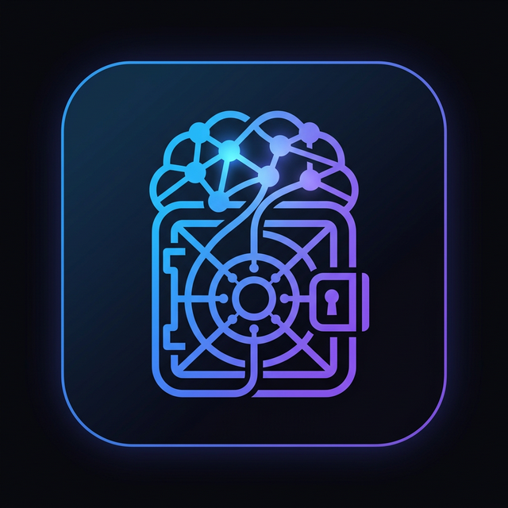

<div align="center">



# ContextVolt ⚡

### **The memory layer for every AI you use.**

*Capture conversations from ChatGPT, Claude, Gemini, Grok, DeepSeek, Perplexity & Copilot —*
*search them semantically, ask them anything, and continue any chat in any LLM with full context.*

<br/>

[](#-quickstart)
[](#-how-it-works)
[](#-features)
[](https://github.com/Rithvickkr/ConVX/releases)

<br/>


</div>

---

<div align="center">

### *Save in ChatGPT → Continue in Claude → Search in Gemini.*
### *All with full context. All on your machine.*

</div>

---

## 🌩️ The Problem

> **Every AI you use has amnesia.**
>
> That brilliant solution ChatGPT gave you last week? Gone. The Claude debugging session from yesterday? Buried in a tab you closed. The Gemini research you did last month? You'd have to start over.
>
> Worse — your knowledge is **fragmented across 7+ platforms** with no way to search across them, no way to bring context from one to another, and no way to make sense of it all.

## ⚡ The Solution

**ContextVolt** is a private, local-first memory vault for all your AI conversations.

It captures every chat from every platform, summarizes them with a local LLM, embeds them for semantic search, and lets you **continue any conversation in any LLM** with one-click context injection. Everything runs on **your machine**. Nothing ever leaves it.

<br/>

<div align="center">

| 🧠 **Remember** | 🔍 **Find** | 🔄 **Continue** |
|:---:|:---:|:---:|
| Auto-summarized + embedded | Semantic + hybrid search | Context-rich prompts in any LLM |
| Across 7+ AI platforms | RAG chat with citations | Cross-context retrieval |

<br/>

**`7` AI Platforms**  ·  **`4` Cloud Providers**  ·  **`40+` API Endpoints**  ·  **`3` Themes**  ·  **`100%` Local**

</div>

---

## 🎯 Who It's For

| You are... | ContextVolt gives you... |
|---|---|
| 👨‍💻 **A developer** juggling Claude for code, ChatGPT for docs, and Copilot in the IDE | One vault for every debugging session — instantly recall the fix from 3 weeks ago |
| 🔬 **A researcher** running deep-dives across Perplexity, Gemini, and DeepSeek | Cross-platform RAG chat with citations — ask your own research like it's a knowledge base |
| ✍️ **A writer or strategist** brainstorming with multiple LLMs | Continue any thread in any model without losing your tone, framing, or notes |
| 🎓 **A student** learning across tools | A personal AI study journal — searchable, exportable, organized by topic |
| 🔒 **A privacy-conscious power user** | Zero telemetry. Zero cloud lock-in. Zero subscription. Your machine, your data, your rules |

---

## ⚡ Quickstart

### 🪟 Windows

**Option A — One-click Installer** *(recommended)*
> Grab [`ContextVolt-Setup.exe`](https://github.com/Rithvickkr/ConVX/releases) → Run → Done.

**Option B — From source**
```bash
git clone https://github.com/Rithvickkr/ConVX.git
cd ConVX
start.bat
```

### 🍏 macOS / 🐧 Linux

```bash
curl -fsSL https://raw.githubusercontent.com/Rithvickkr/ConVX/main/install.sh | bash
```

Then launch anytime with:
```bash
contextvolt
```

### 📦 What Gets Installed

| Component | Details |
|-----------|---------|
| 🐍 **Python 3.10+** | Required — [python.org](https://www.python.org/downloads/) or `brew install python` |
| 🦙 **Ollama** | ✅ Auto-installed if missing — runs local AI models |
| 🤖 **AI Models** | ✅ Auto-pulled — LLM for summarization + embedding model for search |
| 📚 **Dependencies** | ✅ Auto-installed in isolated venv — zero conflicts |

> 💡 A guided **Setup Wizard** walks you through everything on first launch. No terminal needed.

---

## 🧠 How It Works

```
    ┌──────────────────────────────────────────────────────────────┐
    │                  YOUR AI CONVERSATIONS                       │
    │  ChatGPT · Claude · Gemini · Grok · DeepSeek · Perplexity    │
    │                       · Copilot                              │
    └────────────────────────┬─────────────────────────────────────┘
                             │  Browser Extension (one-click capture)
                             ▼
    ┌──────────────────────────────────────────────────────────────┐
    │                    CONTEXTVOLT ENGINE                        │
    │                                                              │
    │   📥 Capture ──→ 🤖 Summarize ──→ 🧩 Chunk ──→ 📐 Embed     │
    │                                                              │
    │       All processing happens locally on YOUR machine         │
    └────────────────────────┬─────────────────────────────────────┘
                             │  Stored in local SQLite + Vector DB
                             ▼
    ┌──────────────────────────────────────────────────────────────┐
    │                    YOUR PRIVATE VAULT                        │
    │                                                              │
    │   🔍 Semantic Search    │  💬 Ask Your Vault (RAG Chat)      │
    │   📋 Continuation       │  🏷️  Collections & Tags            │
    │      Prompts            │  📊 Dashboard & Analytics          │
    │   🔗 Cross-Context      │  📤 Export & Backup                │
    │      Retrieval          │                                    │
    └──────────────────────────────────────────────────────────────┘
```

**The 5-step flow:**

1. **📥 Capture** — Browser extension grabs the full conversation from any supported AI platform
2. **🤖 Summarize** — Local LLM extracts key topics, decisions, code snippets, and open questions
3. **🧩 Chunk & Embed** — Conversation is split into semantic chunks and embedded for vector search
4. **🔍 Search & Ask** — Semantic search across all conversations, or ask questions and get RAG-powered answers with citations
5. **🔄 Continue** — Generate context-rich continuation prompts to resume any conversation in any LLM

---

## ✨ Features

### 🌐 Universal Capture
> One browser extension. **Seven AI platforms.** Zero hassle.

<div align="center">

| Platform | Status | Platform | Status |
|:--------:|:------:|:--------:|:------:|
| **ChatGPT** | ✅ Full support | **Grok** | ✅ Full support |
| **Claude** | ✅ Full support | **DeepSeek** | ✅ Full support |
| **Gemini** | ✅ Full support | **Perplexity** | ✅ Full support |
| **Copilot** | ✅ Full support | | |

</div>

### 🤖 Bring Your Own Model (BYOM)
> Use **any** LLM for summarization — local or cloud. Your choice. Your keys.

| Provider | Models | Cost |
|----------|--------|------|
| 🦙 **Ollama (Local)** | Llama 3, Qwen 2.5, Phi-3, Mistral, Gemma 2, and any model Ollama supports | **Free** — runs on your hardware |
| 🟢 **OpenAI** | GPT-4o, GPT-4o Mini, GPT-4.1 Nano/Mini | Pay-per-use with your API key |
| 🟣 **Anthropic** | Claude Haiku, Sonnet 4, Opus 4 | Pay-per-use with your API key |
| 🔵 **Google** | Gemini 2.5 Flash, Gemini 2.5 Pro | Free tier available |

> 🔒 Cloud API keys are stored locally in `config.json` and never leave your machine.

### 🔍 Intelligent Search

- 🧲 **Semantic search** — find conversations by meaning, not just keywords
- 🔀 **Hybrid retrieval** — combines vector similarity + keyword matching + RRF fusion
- 🎯 **MMR diversity** — results are diverse, not redundant
- 🔗 **Cross-context search** — find related information across all your conversations

### 💬 Ask Your Vault (RAG Chat)

Ask natural-language questions about your entire conversation history. Answers **stream in real-time** (NDJSON) with **inline source citations** linking back to the original conversations. Sessions are saved, renameable, and pinnable — like ChatGPT history, but for your own knowledge base.

> 💭 *"What did I decide about the database schema last week?"*
>
> 💭 *"Show me the Docker commands from my DevOps conversations."*
>
> 💭 *"What were the pros and cons of FastAPI vs Flask from my research?"*

### 🔄 Smart Continuation Prompts

Generate context-rich prompts to continue any conversation in a different LLM:

| Mode | What it does |
|------|--------------|
| **Static** | Full summary + key context |
| **Retrieval** | Query-focused, pulls only relevant chunks |
| **Hybrid** | Summary + targeted retrieval |
| **Cross-context** | Pulls related context from other conversations |

### 🎨 Premium UI

- ✨ Glassmorphism design with three visual themes: **Volt**, **Space**, and **Noir**
- 💬 Interactive chat-bubble view for conversations
- 📊 Dashboard with statistics and quick actions
- 🗂️ Collections for organizing contexts by project or topic

### 👤 Personalized Out of the Box

Tell ContextVolt who you are once — your role, your stack, the projects you work on — and **every continuation prompt and RAG answer is tailored to your context**. No more re-introducing yourself to every new chat.

### 📦 More Features

| Feature | Description |
|---------|-------------|
| 🗂️ **Collections** | Organize conversations into color-coded collections |
| ⭐ **Star & Pin** | Star important contexts, pin Ask Vault sessions |
| 📌 **Important Notes** | Mark critical snippets — they get **priority weighting** in retrieval |
| 🔁 **Re-summarize** | Re-process any context after switching models or improving prompts |
| 📡 **Live Streaming** | Watch summaries, RAG answers, and model downloads stream in real-time |
| 📊 **Dashboard & Analytics** | At-a-glance stats: contexts, chunks, embeddings, activity |
| 🎛️ **In-app Model Manager** | Browse, install, switch, and delete Ollama models without touching a terminal |
| 🔑 **Key Validation** | Test cloud API keys before you save them |
| 📝 **Markdown Export** | Export any conversation as a formatted `.md` file |
| 💾 **Database Backup** | One-click hot backup of your entire vault |
| 🧩 **VS Code Extension** | Browse vault and insert prompts directly in your editor |
| 🪄 **Setup Wizard** | Guided installer — works even if you've never used a terminal |
| 🌗 **Light + Dark** | Three themes (Volt · Space · Noir) with full light-mode support |

---

## 🏗️ Architecture

```
ContextVolt/
├── 🚀 start.bat / start.sh         # Platform launchers
├── 🖥️  run.py                       # Desktop app (FastAPI + PyWebView)
├── 🔧 installer.py                  # GUI setup wizard
│
├── backend/
│   ├── main.py                     # FastAPI server — 40+ API endpoints
│   ├── database.py                 # SQLite + sqlite-vec vector search
│   ├── ollama_client.py            # Local LLM (summarize, embed, chunk)
│   ├── cloud_client.py             # Cloud LLM adapters (OpenAI, Anthropic, Google)
│   ├── llm_router.py               # Unified LLM routing layer
│   └── models.py                   # Pydantic request/response schemas
│
├── frontend/
│   ├── index.html                  # SPA dashboard
│   ├── installer.html              # Setup wizard UI
│   ├── css/                        # Dark theme + glassmorphism styles
│   └── js/app.js                   # Client-side application logic
│
├── extension/                      # Chrome/Edge browser extension (Manifest V3)
│   ├── manifest.json
│   ├── background.js               # Capture + vault import service worker
│   ├── content.js                  # UI overlay for AI platforms
│   └── interceptor.js              # Platform-specific chat extraction
│
└── installer/                      # Windows .exe build (Inno Setup)
```

### 🛠 Tech Stack

| Layer | Technology | Why |
|-------|-----------|-----|
| ⚙️ **Backend** | Python · FastAPI | Async, fast, great ecosystem |
| 🗄️ **Database** | SQLite · sqlite-vec | Zero config, vector search built-in |
| 🖥️ **Desktop** | PyWebView | Native OS WebView — no Electron bloat |
| 🎨 **Frontend** | Vanilla HTML / CSS / JS | Zero build step, instant load |
| 🦙 **Local LLM** | Ollama | Run any open model locally |
| ☁️ **Cloud LLM** | OpenAI · Anthropic · Google APIs | Optional BYOM cloud providers |
| 🧩 **Extension** | Chrome Manifest V3 | Works on Chrome, Edge, Brave, Arc |
| 🔍 **Search** | Cosine similarity · RRF · MMR | Hybrid retrieval for best results |

---

## 🔌 Browser Extension

The extension adds a floating **"Save to Vault"** button on every supported AI platform.

### Install

1. Open `chrome://extensions` (or `edge://extensions`)
2. Enable **Developer Mode** (toggle in top-right)
3. Click **Load unpacked** → select the `extension/` folder

### What It Does

- 📥 **Save** — Capture the full conversation with one click
- 📋 **Import** — Browse your vault and insert continuation prompts directly into the chat
- 🔍 **Search** — Find and import context from past conversations without leaving the AI platform

> Works on **Chrome, Edge, Brave, Arc**, and any Chromium-based browser.

---

## 🔌 API Reference

ContextVolt runs a local API server on `http://127.0.0.1:8000`. Build your own integrations.

<details>
<summary><strong>📋 Click to expand the full API reference</strong></summary>

### Core

| Method | Endpoint | Description |
|--------|----------|-------------|
| `GET` | `/api/health` | Health check |
| `GET` | `/api/system/status` | System diagnostics (Ollama, models, DB) |
| `GET` | `/api/setup/status` | Setup wizard status |
| `POST` | `/api/setup/pull-model` | Trigger model download |
| `POST` | `/api/setup/pull-model-stream` | **Streaming** model download with progress |
| `DELETE` | `/api/setup/delete-model/{model_id}` | Uninstall an Ollama model |
| `POST` | `/api/setup/save-profile` | Save user profile for personalized prompts |
| `POST` | `/api/restart` | Restart the backend server |

### Contexts

| Method | Endpoint | Description |
|--------|----------|-------------|
| `POST` | `/api/capture` | Capture a conversation (from extension) |
| `POST` | `/api/summarize` | Summarize raw text |
| `POST` | `/api/summarize/stream` | **Streaming** summarization with live tokens |
| `POST` | `/api/contexts/{id}/resummarize` | Re-summarize an existing context |
| `POST` | `/api/contexts` | Create a new context |
| `GET` | `/api/contexts` | List contexts (paginated, searchable) |
| `GET` | `/api/contexts/{id}` | Get a single context |
| `PUT` | `/api/contexts/{id}` | Update a context |
| `DELETE` | `/api/contexts/{id}` | Delete a context |
| `POST` | `/api/contexts/{id}/star` | Toggle star/pin |
| `POST` | `/api/contexts/bulk-delete` | Bulk delete contexts |
| `POST` | `/api/contexts/embed-all` | Backfill all embeddings |
| `POST` | `/api/contexts/chunk-all` | Re-chunk and re-embed all |

### Prompts & Retrieval

| Method | Endpoint | Description |
|--------|----------|-------------|
| `POST` | `/api/contexts/{id}/prompt` | Generate continuation prompt |
| `GET` | `/api/contexts/{id}/chunks` | Get chunks with similarity scores |
| `POST` | `/api/retrieve` | Cross-context retrieval prompt |
| `POST` | `/api/retrieve/search` | Cross-context search (raw results) |

### Ask Vault (RAG Chat)

| Method | Endpoint | Description |
|--------|----------|-------------|
| `POST` | `/api/vault/ask` | Ask a question (streaming NDJSON) |
| `GET` | `/api/vault/sessions` | List all chat sessions |
| `GET` | `/api/vault/sessions/{id}` | Get session with messages |
| `PATCH` | `/api/vault/sessions/{id}` | Rename or pin a session |
| `DELETE` | `/api/vault/sessions/{id}` | Delete a session |

### Collections

| Method | Endpoint | Description |
|--------|----------|-------------|
| `GET` | `/api/collections` | List all collections |
| `POST` | `/api/collections` | Create a collection |
| `PUT` | `/api/collections/{id}` | Update a collection |
| `DELETE` | `/api/collections/{id}` | Delete a collection |
| `POST` | `/api/contexts/{id}/collection` | Assign context to collection |

### Export & System

| Method | Endpoint | Description |
|--------|----------|-------------|
| `GET` | `/api/contexts/{id}/export` | Export as Markdown |
| `GET` | `/api/contexts/{id}/export/download` | Download as `.md` file |
| `GET` | `/api/backup/download` | Download database backup |
| `GET` | `/api/stats` | Database statistics |
| `GET` | `/api/dashboard` | Dashboard analytics (counts, recents, activity) |
| `GET` | `/api/debug/logs` | View application logs |
| `GET` | `/api/debug/ollama` | Ollama diagnostics |

### LLM Configuration

| Method | Endpoint | Description |
|--------|----------|-------------|
| `GET` | `/api/models` | List available Ollama models |
| `POST` | `/api/model/select` | Switch LLM model |
| `POST` | `/api/embed-model/select` | Switch embedding model |
| `POST` | `/api/cloud/key` | Save a cloud API key |
| `POST` | `/api/cloud/validate` | Validate a cloud API key |
| `POST` | `/api/cloud/provider` | Switch active provider |
| `GET` | `/api/cloud/providers` | List cloud providers & models |

</details>

---

## ⚙️ Configuration

### Switch LLM Model

Change your model anytime from the **Settings** page in the app, or edit `config.json`:

```json
{
  "model": "llama3.2:3b",
  "embed_model": "nomic-embed-text",
  "provider": "ollama"
}
```

### Use Cloud LLMs

Add your API key in **Settings → Cloud Providers**, or edit `config.json`:

```json
{
  "provider": "google",
  "cloud_keys": { "google": "your-api-key" },
  "cloud_models": { "google": "gemini-2.5-flash" }
}
```

Supported cloud providers: **OpenAI · Anthropic (Claude) · Google (Gemini)**.

---

## 🥊 vs. The Competition

<div align="center">

| Feature | **ContextVolt** | ChatGPT Memory | Mem0 | Rewind AI |
|---------|:---------------:|:--------------:|:----:|:---------:|
| Works across all LLMs | ✅ | ❌ ChatGPT only | ✅ | ❌ |
| 100% local / self-hosted | ✅ | ❌ | ❌ Cloud | ❌ |
| Semantic search | ✅ | ❌ | ✅ | ✅ |
| RAG chat with citations | ✅ | ❌ | ❌ | ❌ |
| Continuation prompts | ✅ | ❌ | ❌ | ❌ |
| Open source | ✅ | ❌ | Partial | ❌ |
| Free | ✅ | Paid | Freemium | Paid |
| Browser-extension capture | ✅ | ❌ | ❌ | ❌ |
| BYOM (any LLM) | ✅ | ❌ | ❌ | ❌ |

</div>

---

## 🗺️ Roadmap

- [ ] 🔌 **MCP Server** — Let Claude Desktop, Cursor, and Windsurf auto-query your vault
- [ ] 🕸️ **Knowledge Graph** — Entity extraction and relationship mapping across conversations
- [ ] 🤖 **Auto-Capture** — Automatically save conversations without clicking
- [ ] ⏳ **Memory Lifecycle** — Recency- and frequency-weighted retrieval
- [ ] 📱 **Mobile Companion** — PWA for accessing your vault on the go
- [ ] 🟣 **Obsidian Plugin** — Sync your vault with your knowledge base

---

## 🤝 Contributing

Contributions, issues, and feature requests are welcome — let's make AI memory better together.

```bash
git clone https://github.com/Rithvickkr/ConVX.git
cd ConVX
python -m venv venv
venv\Scripts\activate        # Windows
source venv/bin/activate     # macOS/Linux
pip install -r requirements.txt
python run.py
```

The app opens at `http://localhost:8000`. Frontend lives in [frontend/](frontend/), backend in [backend/](backend/).

---

## 📄 License

**MIT** — do whatever you want with it.

---

<div align="center">

### ⚡ If ContextVolt saves you from re-explaining context to an AI, drop a ⭐

<br/>

**[⬇ Download](https://github.com/Rithvickkr/ConVX/releases)** · **[🐛 Report a Bug](https://github.com/Rithvickkr/ConVX/issues)** · **[💡 Request a Feature](https://github.com/Rithvickkr/ConVX/issues)**

<br/>

Built with ⚡ by **[Rithvick](https://github.com/Rithvickkr)**

<sub>Your AI conversations. Your machine. Your memory.</sub>

</div>
